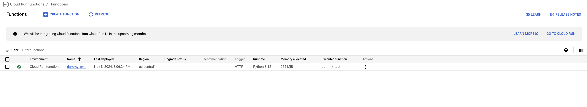
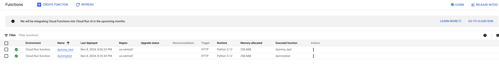
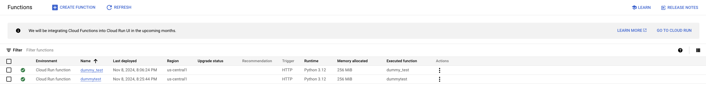

# Repro for issue 7365

## Versions

firebase-tools: v13.24.1<br>
node: v20.12.2<br>
platform: macOS Sonoma 14.7

## Setup

1. Run `cd functions`
1. Run `python3.12 -m venv venv`
1. Run `. "/Users/<path>/functions/venv/bin/activate" && python3.12 -m pip install -r requirements.txt`
   - `. ./venv/bin/activate && python3.12 -m pip install -r requirements.txt` should also work

## Steps to reproduce

1. Run `firebase deploy --only functions --project PROJECT_ID`
   - Error is raised, however, the `dummy_test` is deployed

```
i  functions: preparing functions directory for uploading...
i  functions: packaged /Users/<path>/issues/7365/functions (1.22 KB) for uploading
i  functions: ensuring required API cloudtasks.googleapis.com is enabled...
✔  functions: required API cloudtasks.googleapis.com is enabled
i  functions: ensuring required API run.googleapis.com is enabled...
i  functions: ensuring required API eventarc.googleapis.com is enabled...
i  functions: ensuring required API pubsub.googleapis.com is enabled...
i  functions: ensuring required API storage.googleapis.com is enabled...
✔  functions: required API run.googleapis.com is enabled
✔  functions: required API eventarc.googleapis.com is enabled
✔  functions: required API pubsub.googleapis.com is enabled
✔  functions: required API storage.googleapis.com is enabled
i  functions: generating the service identity for pubsub.googleapis.com...
i  functions: generating the service identity for eventarc.googleapis.com...
✔  functions: functions folder uploaded successfully
i  functions: creating Python 3.12 (2nd Gen) function dummy_test(us-central1)...
Request to https://cloudtasks.googleapis.com/v2/projects/PROJECT_ID-testproj/locations/us-central1/queues/dummy_test had HTTP Error: 400, Queue ID "dummy_test" can contain only letters ([A-Za-z]), numbers ([0-9]), or hyphens (-). Queue ID must be between 1 and 100 characters.

Functions deploy had errors with the following functions:
        dummy_test(us-central1)
i  functions: cleaning up build files...

Error: There was an error deploying functions
```



2. Rename `dummy_test` to `dummytest` in functions/main.py
3. Run `firebase deploy --only functions --project PROJECT_ID`
   - ? Would you like to proceed with deletion? Selecting no will continue the rest of the deployments. (Yes)

```i functions: preparing functions directory for uploading...
i  functions: packaged /Users/<PATH>/issues/7365/functions (1.22 KB) for uploading
i  functions: ensuring required API cloudtasks.googleapis.com is enabled...
✔  functions: required API cloudtasks.googleapis.com is enabled
i  functions: ensuring required API run.googleapis.com is enabled...
i  functions: ensuring required API eventarc.googleapis.com is enabled...
i  functions: ensuring required API pubsub.googleapis.com is enabled...
i  functions: ensuring required API storage.googleapis.com is enabled...
✔  functions: required API run.googleapis.com is enabled
✔  functions: required API eventarc.googleapis.com is enabled
✔  functions: required API storage.googleapis.com is enabled
✔  functions: required API pubsub.googleapis.com is enabled
i  functions: generating the service identity for pubsub.googleapis.com...
i  functions: generating the service identity for eventarc.googleapis.com...
✔  functions: functions folder uploaded successfully

The following functions are found in your project but do not exist in your local source code:
        dummy_test(us-central1)

If you are renaming a function or changing its region, it is recommended that you create the new function first before deleting the old one to prevent event loss. For more info, visit https://firebase.google.com/docs/functions/manage-functions#modify

? Would you like to proceed with deletion? Selecting no will continue the rest of the deployments. Yes
i  functions: creating Python 3.12 (2nd Gen) function dummytest(us-central1)...
i  functions: deleting Python 3.12 (2nd Gen) function dummy_test(us-central1)...
Request to https://cloudtasks.googleapis.com/v2/projects/PROJECT_ID/locations/us-central1/queues/dummy_test?updateMask=name%2Cstate had HTTP Error: 400, Queue ID "dummy_test" can contain only letters ([A-Za-z]), numbers ([0-9]), or hyphens (-). Queue ID must be between 1 and 100 characters.
✔  functions[dummytest(us-central1)] Successful create operation.


Functions deploy had errors with the following functions:
        dummy_test(us-central1)
i  functions: cleaning up build files...

Error: There was an error deploying functions
```



## Notes

When trying to delete the function using `firebase functions:delete dummy_test --project PROJECT_ID`, a similar error is raised

```
$ firebase functions:delete dummy_test --project PROJECT_ID
? You are about to delete the following Cloud Functions:
        dummy_test(us-central1)
  Are you sure? Yes
i  functions: deleting Python 3.12 (2nd Gen) function dummy_test(us-central1)...
Request to https://cloudtasks.googleapis.com/v2/projects/PROJECT_ID/locations/us-central1/queues/dummy_test?updateMask=name%2Cstate had HTTP Error: 400, Queue ID "dummy_test" can contain only letters ([A-Za-z]), numbers ([0-9]), or hyphens (-). Queue ID must be between 1 and 100 characters.

Functions deploy had errors with the following functions:
        dummy_test(us-central1)
i  functions: cleaning up build files...
```


